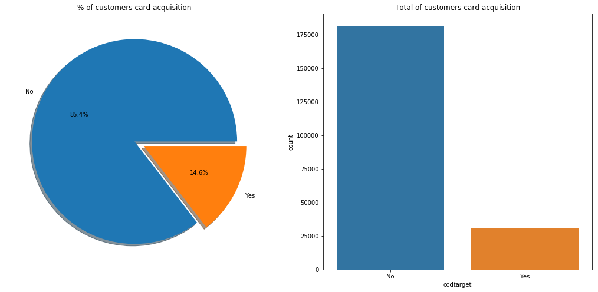

# Total-profit-improving-using-ML
# Setup
* Python 3.7

# Description
The code provides the explanation of how to use machine learning to maximize the total profit in a bank company, specially using datasets from the datathon international interbank in which I finished sixth. Link: [Interbank-internacional-2019](https://www.kaggle.com/c/interbank-internacional-2019/overview)

